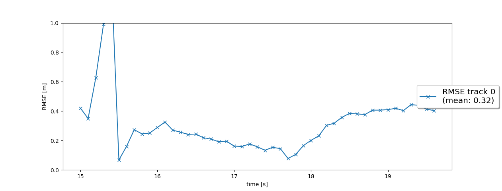
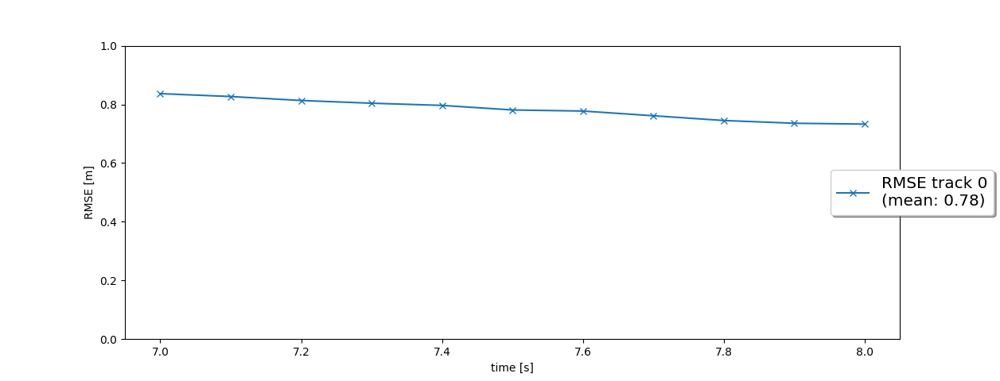
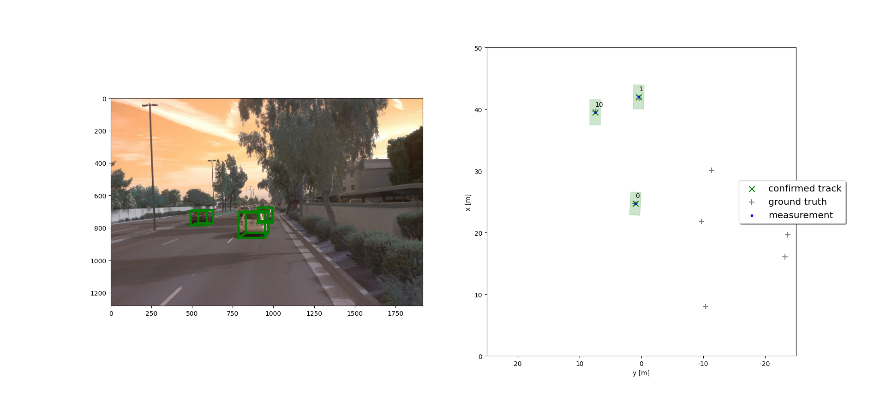
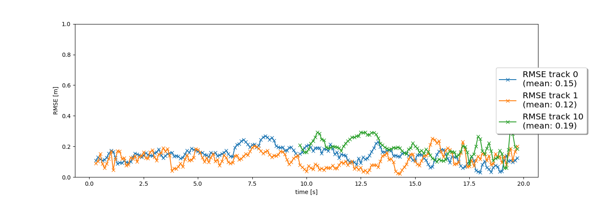
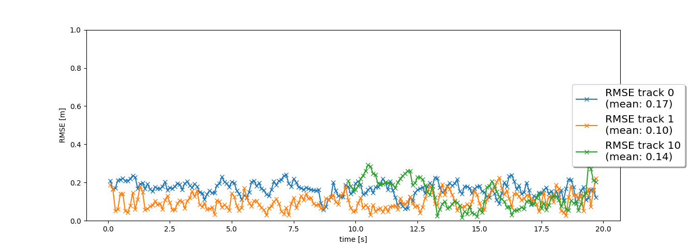

# Final Project: Sensor Fusion and Object Tracking

This is the final project of the section "Sensor Fusion and Tracking" in [Udacity's Nanodegree Program "Self Driving Car Engineer"](https://www.udacity.com/course/self-driving-car-engineer-nanodegree--nd0013).

## 1. Tracking

The functions related to tracking have been implemented in [filter.py](student/filter.py).  The resulting RMSE is shown below.  Despite a relatively high initial error, it is gradually reduced to reach a mean below 0.35 m.

## 2. Track Management

The functions related to the track management have been implemented in [trackmanagement.py](student/trackmanagement.py).  The following table illustrates the succession of relevant events:

|# frame | Event | Explanation |
|---|---|---|
| 67 | Track 0 is created | / |
| 68 | Track 0 is tentative | Detected a second time |
| 71 | Track 0 is confirmed | Threshold score of 0.8 reached |
| 97 | Track 0 is removed | Thresholed of estimation error covariance reached |

The mean RMSE remains relatively high at 0.78 m due to a y-offset of the lidar detection as explained in the project instructions:

## 3. Data Association

The functions related to the data association have been implemented in [association.py](student/association.py).  The following figure illustrates that multiple vehicles are successfully tracked.

The RMSE plot below indicates that track 0 and 1 have been active for the entire duration, while track 10 only became active at about 10s.  This can be explained by vehicles 0 and 1 moving approximately at the same speed than the measuring vehicles, while vehicle 10 overtakes the latter.

## 4. Sensor Fusion

The functions related to the sensor fusion have been implemented in [measurements.py](student/measurements.py).  The figure below shows that the RMSE has on average been reduced with the help of the additional camera data.

## 5. Evaluation and Conclusion

The results of the previous sections can be summarized in this video: [Link](img/video.mp4)

### 5.1. Recap of the four tracking steps, results andmost difficult part

### 5.2. Benefits of sensor fusion

### 5.3. Challenges

### 5.4. Directions for Improvement

